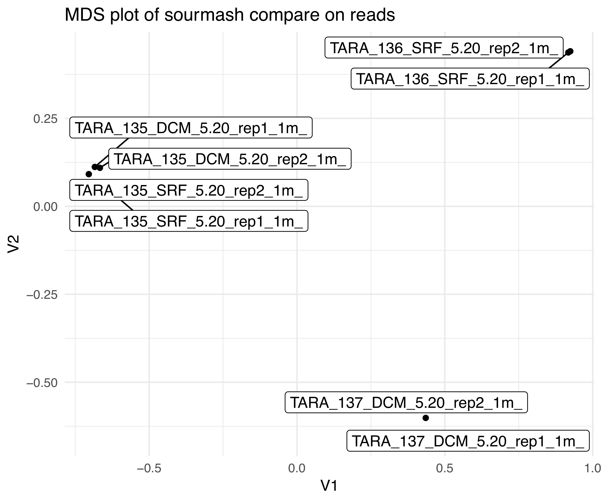
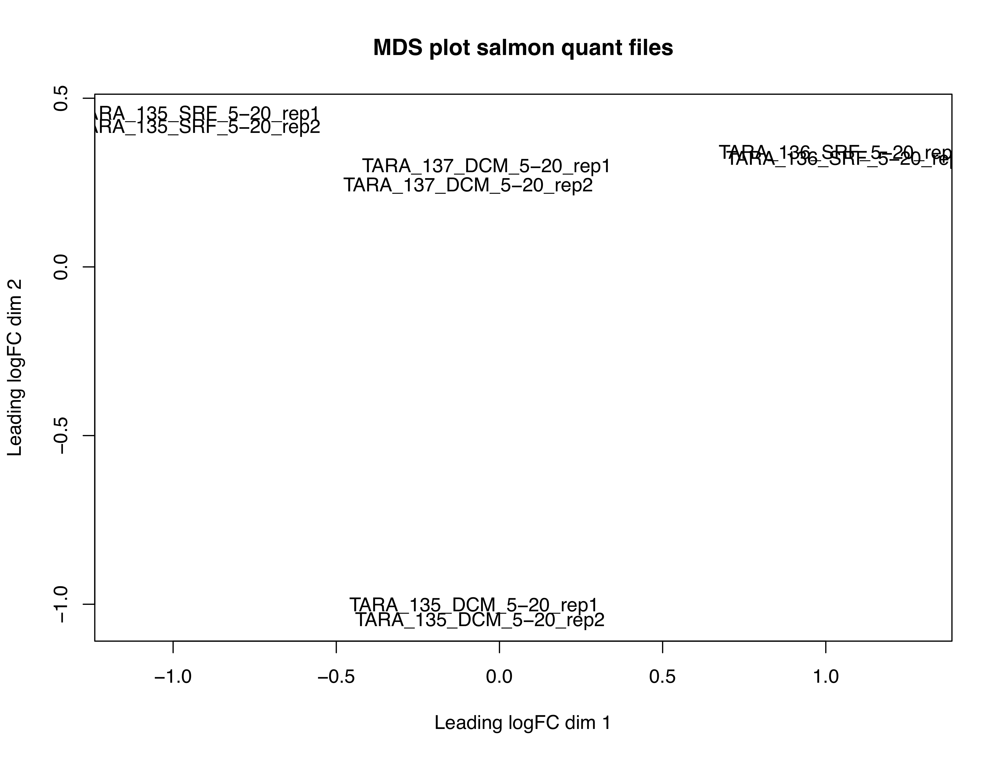

How well did our assembly work?

## Set up the directory 

First, make sure you have the `PROJECT` variable defined:

```
echo $PROJECT
```
if you don't see any output, make sure to redefine the $PROJECT variable.

	
Now, let's create a folder `evaluation` to work in:

```
cd $PROJECT
mkdir -p evaluation
cd evaluation
```

Now, let's copy in the assembly we made in the previous lesson:

```
cp $PROJECT/assembly/tara135_SRF_megahit.fasta ./
```

## Generate assembly statistics with Transrate

[Transrate](http://hibberdlab.com/transrate/getting_started.html) is a program that can be used for a couple different types of assembly evaluation. The first and simplest method is to calculate length-based metrics about the assembly, such as the total number of bases, and the N50 of the contigs. Transrate can also be used to compare two assemblies or give you a score which represents proportion of input reads that provide positive support for the assembly. For a further explanation of metrics and how to run the reference-based transrate, see the [documentation](http://hibberdlab.com/transrate/metrics.html) and the paper by [Smith-Unna et al. 2016](http://genome.cshlp.org/content/early/2016/06/01/gr.196469.115). 

We have installed transrate for you. However, if you need to install it in the future, see installation instructions [here](setting-up-tara-environment.md).

See options for running transrate:
```
transrate -h
```

Let's use transrate to calculate some stats on our assembly contigs:

```
transrate --assembly tara135_SRF_megahit.fasta
```

You should see output that looks like this:
```
[ INFO] 2018-11-06 23:50:35 : Loading assembly: /LUSTRE/bioinformatica_data/bioinformatica2018/assembly/tara135_SRF_megahit.fasta
[ INFO] 2018-11-06 23:50:35 : Analysing assembly: /LUSTRE/bioinformatica_data/bioinformatica2018/assembly/tara135_SRF_megahit.fasta
[ INFO] 2018-11-06 23:50:35 : Results will be saved in /LUSTRE/bioinformatica_data/bioinformatica2018/assembly/transrate_results/tara135_SRF_megahit
[ INFO] 2018-11-06 23:50:35 : Calculating contig metrics...
[ INFO] 2018-11-06 23:50:35 : Contig metrics:
[ INFO] 2018-11-06 23:50:35 : -----------------------------------
[ INFO] 2018-11-06 23:50:35 : n seqs                         1502
[ INFO] 2018-11-06 23:50:35 : smallest                        200
[ INFO] 2018-11-06 23:50:35 : largest                        4998
[ INFO] 2018-11-06 23:50:35 : n bases                      638347
[ INFO] 2018-11-06 23:50:35 : mean len                      425.0
[ INFO] 2018-11-06 23:50:35 : n under 200                       0
[ INFO] 2018-11-06 23:50:35 : n over 1k                        40
[ INFO] 2018-11-06 23:50:35 : n over 10k                        0
[ INFO] 2018-11-06 23:50:35 : n with orf                      331
[ INFO] 2018-11-06 23:50:35 : mean orf percent              83.54
[ INFO] 2018-11-06 23:50:35 : n90                             232
[ INFO] 2018-11-06 23:50:35 : n70                             360
[ INFO] 2018-11-06 23:50:35 : n50                             453
[ INFO] 2018-11-06 23:50:35 : n30                             599
[ INFO] 2018-11-06 23:50:35 : n10                             935
[ INFO] 2018-11-06 23:50:35 : gc                             0.51
[ INFO] 2018-11-06 23:50:35 : bases n                           0
[ INFO] 2018-11-06 23:50:35 : proportion n                    0.0
[ INFO] 2018-11-06 23:50:35 : Contig metrics done in 0 seconds
[ INFO] 2018-11-06 23:50:35 : No reads provided, skipping read diagnostics
[ INFO] 2018-11-06 23:50:35 : No reference provided, skipping comparative diagnostics
[ INFO] 2018-11-06 23:50:35 : Writing contig metrics for each contig to /LUSTRE/bioinformatica_data/bioinformatica2018/assembly/transrate_results/tara135_SRF_megahit/contigs.csv
[ INFO] 2018-11-06 23:50:35 : Writing analysis results to assemblies.csv
```

## Comparing Assemblies

We built a metatranscriptome with the full set of TARA_SRF reads. Copy this into your evaluation directory
```
cd ${PROJECT}/evaluation
cp tara125_SRF_full_megahit.fasta ./
```

* How do the two transcriptomes compare with each other?

```
transrate --reference=tara135_SRF_full_megahit.fasta --assembly=tara135_SRF_megahit.fasta --output=full_v_subset
transrate --reference=tara135_SRF_megahit.fasta --assembly=tara135_SRF_full_megahit.fasta --output=subset_v_full
```

## How well does this assembly represent our sequenced reads? 

It's useful to know how well the transcripts represent the sequenced reads. To do this, we'll need to link in the reads we used to generate this assembly: 

```
ln -s ${PROJECT}/trimmed/TARA_135_SRF_5-20_*.qc.fq.gz ./
```


# Mapping reads to a metatranscriptome

We will use [Salmon](http://salmon.readthedocs.org/en/latest/) to
quantify expression. Salmon is a new breed of software for quantifying RNAseq reads that is both really fast and takes
transcript length into consideration ([Patro et al. 2017](https://www.nature.com/articles/nmeth.4197)).

For further reading, see

  * Intro blog post: http://robpatro.com/blog/?p=248
  * A 2016 blog post evaluating and comparing methods [here](https://cgatoxford.wordpress.com/2016/08/17/why-you-should-stop-using-featurecounts-htseq-or-cufflinks2-and-start-using-kallisto-salmon-or-sailfish/)
  * Salmon github repo [here](https://github.com/COMBINE-lab/salmon)
  * 2018 paper: [A direct comparison of genome alignment and transcriptome pseudoalignment](https://www.biorxiv.org/content/early/2018/10/16/444620)


## Quantification with Salmon

Check that salmon is available and see run options:
```
salmon -h
```

Now let's check that we still have the trimmed data we created day 1:

```
set -u
printf "\nMy trimmed data is in $PROJECT/quality/, and consists of $(ls -1 ${PROJECT}/quality/*.qc.fq.gz | wc -l) files\n\n"
set +u

```
where set -u should let you know if you have any unset variables, i.e. if the `$PROJECT` variable is not defined. 

If you see `-bash: PROJECT: unbound variable`, then you need to set the $PROJECT variable.  
```
export PROJECT= ~/work
```
and then re-run the `printf` code block.

NOTE: if you do not have files, please rerun quality trimming steps [here](short-read-quality-control.md)

## Create a directory to work in

```
   cd ${PROJECT}
   mkdir -p quant
   cd quant
```

## Link an assembly

We use a full assembly to use for mapping. This assembly was made with all TARA_135 SRF reads, rather than the subset we used in the [assembly](megahit-assembly.md) tutorial.


```
ln -s /LUSTRE/bioinformatica_data/bioinformatica2018/assembly/tara_f135_full_megahit.fasta ./
```

## Run Salmon

Build an index for the metatranscriptome:

```
    salmon index --index tara135 --transcripts tara_f135_full_megahit.fasta
```

Next, link in the QC reads (produced in [quality](short-read-quality-control.md):

```
   ln -s ../quality/*.qc.fq.gz ./
```


Then, run the salmon mapping:

```
for sample in *1.qc.fq.gz
do
  base=$(basename $sample _1.fq.gz)
  echo $base
  salmon quant -i tara135 -p 2 -l A -1 ${base}_1.qc.fq.gz -2 ${base}_2.qc.fq.gz -o ${base}_quant
done
```

This will create a bunch of directories named something like
`TARA_135_SRF_5-20_rep1_quant`, containing a bunch of files. Take a
look at what files there are:

You should see:

```
   aux_info
   cmd_info.json
   lib_format_counts.json
   libParams
   logs
   quant.sf
```
The two most interesting files are `quant.sf`, which contains the counts,
and `salmon_quant.log` (in the `logs` directory), which contains a
log from the salmon run.

# Looking at count data 

The `quant.sf` files contain the relevant information about
contig expression -- take a look

```
   head -20 TARA_135_SRF_5-20_rep1_1m_quant/quant.sf 
```

You should see output that looks like this:
```
Name	Length	EffectiveLength	TPM	NumReads
k119_5	212	63.757	0.000000	0.000
k119_10	231	75.730	0.000000	0.000
k119_14	261	97.683	0.000000	0.000
k119_16	301	130.690	11.736728	1.000
k119_18	302	131.560	0.000000	0.000
k119_21	203	58.357	0.000000	0.000
k119_22	308	136.790	0.000000	0.000
```

The first column contains the transcript names, and the
fifth column is the "raw counts", which is what many 
differential expression programs need.

# Assess Mapping rate

Okay, we got some numbers for woo much the transcripts were expressed, but how well did the reads map overall? 
Let's go look at one of the log files to see.

```
less TARA_135_SRF_5-20_rep1_1m_quant/logs/salmon_quant.log

```

How well did the reads map to the metatranscriptome?

Let's see how the rest of the files mapped. We can 
look at the mapping rate in each log file by executing
the following:

```
grep Mapping *quant/logs/*
```

grep is a handy program that finds and prints lines in files that match a pattern. In this case, 
the pattern we're searching for is the word 'Mapping', and we're searching in any directory that 
ends in `quant` and has a logs directory with at least one file in it.

How do the mapping rates compare? What does this tell us about our metatranscriptome?

## How well does quantification capture sample distances?

We made an MDS plot of our `sourmash compare` results yesterday. With our salmon
`quant.sf` files, we can also make and MDS plot and see how different the two are.
This will demonstrate how well mapping to our assembly captures the information
in our reads. 

We already ran the code to do this, but if you want to see what it looks like, 
you can find it [here](https://raw.githubusercontent.com/ngs-docs/2018-cicese-metatranscriptomics/master/scripts/salmon_mds_plot.R). It relies on the `quant.sf` files output by Salmon. 




Look how different they are! To be fair, we only mapped back to a full transcriptome
with 1 million reads, but this is still a good test. 

## Another way to assess read mapping?

Transrate actually  has a `read assessment` mode that uses `salmon` to "align" reads to the transcriptome and generates some metrics on read mapping. 

We won't run this today, but you could run it via:

```
transrate --assembly=tara135_SRF_megahit.fasta --threads=2 --left=*_1.qc.fq.gz --right *_2.qc.fq.gz --output=${PROJECT}/evaluation/tara135_SRF_transrate
```
 

## Other useful tutorials and references

 - https://github.com/ngs-docs/2015-nov-adv-rna/blob/master/salmon.rst
 - http://angus.readthedocs.io/en/2016/rob_quant/tut.html
 - https://2016-aug-nonmodel-rnaseq.readthedocs.io/en/latest/quantification.html
