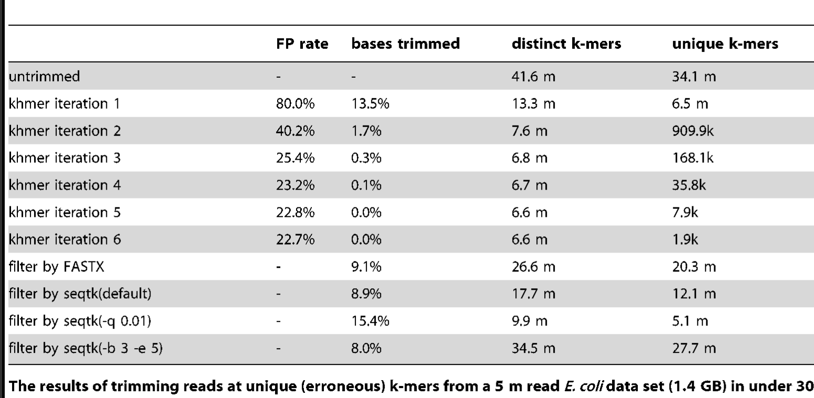
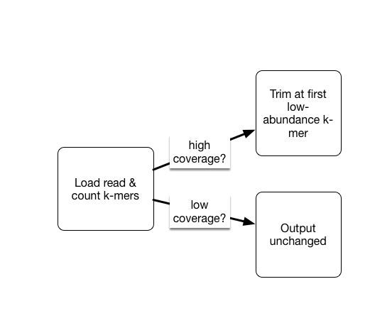

## Why (or why not) do k-mer trimming?

Even after quality trimming with Trimmomatic, our reads will still contain erros. Why? 

First, Trimmomatic trims based solely on the quality score, which is a statistical statement about the correctness of a base - a Q score of 30 means that, of 1000 bases with that Q score, 1 of those bases will be wrong. So, a base can have a high Q score and still be wrong! (and many bases will have a low Q score and still be correct)

Second, we trimmed very lightly - only bases that had a very low quality were removed. This was intentional because with assembly, you want to retain as much coverage as possible, and the assembler will generally figure out what the “correct” base is from the coverage.

An alternative to trimming based on the quality scores is to trim based on k-mer abundance - this is known as k-mer spectral error trimming. K-mer spectral error trimming always beats quality score trimming in terms of eliminating errors; e.g. look at this table from [Zhang et al., 2014](https://journals.plos.org/plosone/article?id=10.1371%2Fjournal.pone.0101271):



The basic logic is this: if you see low abundance k-mers in a high coverage data set, those k-mers are almost certainly the result of errors. (Caveat: strain variation could also create them.)

In metagenomic data sets we do have the problem that we may have very low and very high coverage data. So we don’t necessarily want to get rid of all low-abundance k-mers, because they may represent truly low abundance (but useful) data.

As part of the khmer project in our lab, we have developed an approach that sorts reads into high abundance and low abundance reads, and only error trims the high abundance reads.



This does mean that many errors may get left in the data set, because we have no way of figuring out if they are errors or simply low coverage, but that’s OK (and you can always trim them off if you really care).


## Kmer trimming with Khmer

To properly compare our TARA samples, we need to remove these sequence errors. This can also speed up assembly and reduce memory 
requirements (although many assemblers have built in k-mer trimming mechanisms as well).


## Set up workspace and install khmer 

[khmer documentation](http://khmer.readthedocs.io/en/latest)

We've already installed khmer for you, but here's the command if you need to install it in the future:
```
conda install khmer
```

Make sure you have the $PROJECT variable defined:
```
echo $PROJECT
```
if you don't see any output, make sure to redefine the $PROJECT variable.


Now, let's create a directory to work in:

```
cd ${PROJECT}
mkdir -p khmer_trim
cd khmer_trim
```

Let's choose a sample to start with: `TARA_135_SRF_5-20`

And link in the `qc` trimmed files.

```
ln -s ${PROJECT}/trim/TARA_135_SRF_5-20_*qc.fq.gz ./
```

## Run Khmer 

To run error trimming, use the khmer script `trim-low-abund.py`:

```
for filename in *_1.qc.fq.gz
do
  #Use the program basename to remove _1.qc.fq.gz to generate the base
  base=$(basename $filename _1.qc.fq.gz)
  echo $base

  interleave-reads.py ${base}_1.qc.fq.gz ${base}_2.qc.fq.gz | \
  trim-low-abund.py - -V -Z 10 -C 3 -o - --gzip -M 8e9 | \
  extract-paired-reads.py --gzip -p ${base}.khmer.pe.fq.gz -s ${base}.khmer.se.fq.gz

done
```

## Assess changes in kmer abundance

To see how many k-mers we removed, you can examine the distribution as above,
or use the `unique-kmers.py` script. Let's compare kmers for one sample.

```
unique-kmers.py TARA_135_SRF_5-20_rep1_1m_1.qc.fq.gz TARA_135_SRF_5-20_rep1_1m_2.qc.fq.gz
unique-kmers.py TARA_135_SRF_5-20_rep1_1m.khmer.pe.fq.gz
```  

The first two files (the adapter-trimmed inputs) have a total estimated number of
unique 32-mers of 26760613; the second (trimmed) file has a total
estimated number of unique 32-mers 26659070.  So the trimming removed
approximately 100,000 k-mers.

These numbers are virtually the same BECAUSE WE ARE USING SMALL SUBSET
DATA SETS. For any real data sets, the second number will be MUCH smaller
than the first, indicating that many low-abundance k-mers were removed as
likely errors.


For more info and some neat visualization of kmer trimming, go [here](https://2017-cicese-metagenomics.readthedocs.io/en/latest/kmer_trimming.html)
