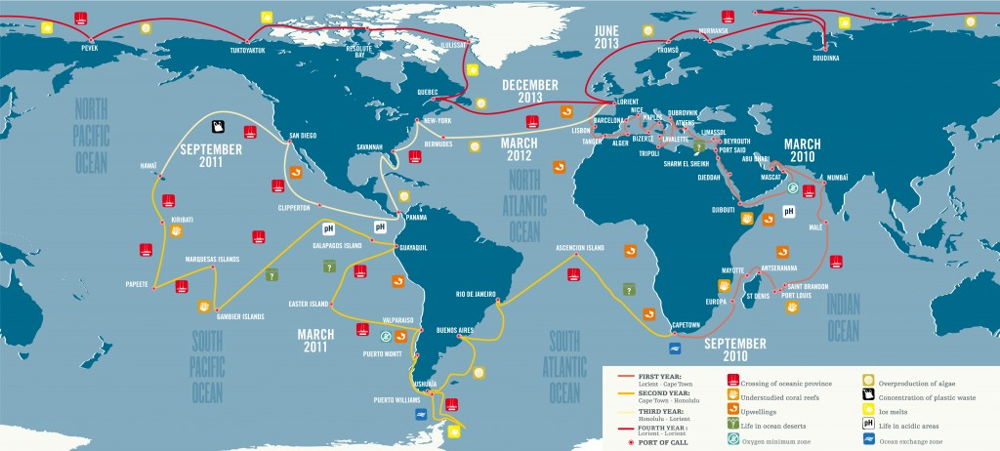
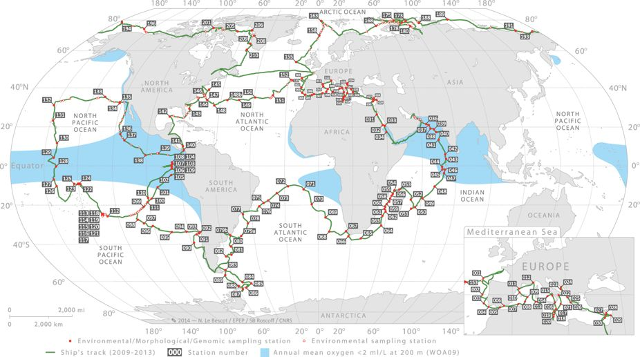

# Intro to sample dataset: TARA Oceans

The [TARA Oceans Expedition](https://oceans.taraexpeditions.org/en/m/about-tara/les-expeditions/tara-oceans/) (2009–2013) sampled contrasting ecosystems of the world oceans, collecting environmental data and plankton, from viruses to metazoans, for later analysis using modern sequencing and state-of-the-art imaging technologies. It surveyed 210 ecosystems in 20 biogeographic provinces, collecting over 35,000 samples of seawater and plankton [Pesant et al.
2015](https://www.nature.com/articles/sdata201523#f2).

We chose data analyzed as part of [Carradec et al. 2018: A global ocean atlas of eukaryotic genes](https://www.nature.com/articles/s41467-017-02342-1). This paper used a metatranscriptomics approach on the TARA Oceans data to generate a global ocean reference catalog of genes from planktonic eukaryotes and to explore their expression patterns with respect to biogeography and environmental conditions.

For this workshop, we chose TARA Stations 135, 136, and 137 in the eastern pacific, which you can see on the map below. We analyze data from mRNAseq samples (poly-A selected and thus likely to contain mostly eukaryotic sequences) in the 5-20µm size fraction, as this fraction had good replication across our chosen TARA stations. For most of the tutorials, we use small subsets of these data, to make program runtimes feasible during the workshop. You can find the
full data via [Open science resources for the discovery and analysis of Tara Oceans data](https://www.nature.com/articles/sdata201523#f2).

)

Recommended Reading:

[A global ocean atlas of eukaryotic genes](https://www.nature.com/articles/s41467-017-02342-1)
[Open science resources for the discovery and analysis of Tara Oceans data](https://www.nature.com/articles/sdata201523#f2)

